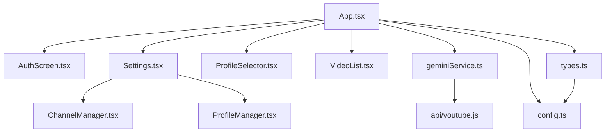

# AGENTS.MD - TubeTracker AI

## Project Overview
TubeTracker AI is a privacy-focused web application that tracks recent YouTube video uploads from user-specified channels. It provides a clean, algorithm-free feed without YouTube's recommendation distractions.

**Key Value Proposition:**
- Algorithm-free chronological video feeds from tracked channels
- Privacy-first: no accounts, no tracking, local data storage
- PIN-based access control
- YouTube API key never exposed to client

## Tech Stack
- **Frontend**: React 19 + TypeScript + Vite
- **Styling**: Tailwind CSS + Lucide React icons
- **Backend**: Vercel Serverless Functions
- **APIs**: YouTube Data API v3, Google GenAI SDK
- **Build**: Vite for frontend, Vercel CLI for local dev

## Critical Architecture Notes

### Security Model
1. **API Key Management**: YouTube API key is server-side only via Vercel Environment Variables (`API_KEY`)
2. **Authentication**: Simple PIN-based access (`AUTH_PIN` environment variable)
3. **Data Storage**: localStorage only - no backend database
4. **Client never sees API key** - all API calls go through `/api/youtube.js` proxy

### Project Structure
```
tubetracker-ai/
├── api/
│   └── youtube.js          # Serverless API proxy (PIN validation, API key injection)
├── components/
│   ├── AuthScreen.tsx      # PIN entry screen
│   ├── ChannelManager.tsx # Add/remove channels (handles like @channelname)
│   ├── ProfileManager.tsx # Profile CRUD operations
│   ├── ProfileSelector.tsx# Profile switching UI
│   ├── Settings.tsx       # App preferences (lookback days, auto-refresh, theme)
│   └── VideoList.tsx      # Video display grid with search/filter
├── services/
│   └── geminiService.ts   # API communication layer (misnamed - no Gemini API)
├── types.ts               # TypeScript interfaces (Channel, VideoResult, Profile, AppConfig)
├── config.ts              # Default configuration (defaultChannels, settings)
├── App.tsx                # Main component (state management, persistence, auto-refresh)
└── package.json           # Dependencies (react 19, @google/genai, lucide-react)
```

### Key Interfaces (types.ts)
- `Channel`: YouTube channel data (id, name, handle, thumbnail, uploadsPlaylistId)
- `VideoResult`: Video metadata (id, title, channelName, url, publishedAt, thumbnail, etc.)
- `Profile`: Channel grouping (id, name, channels array, createdAt timestamp)
- `AppConfig`: User settings (daysBack, autoRefreshHours, theme, activeProfileId, etc.)

## Configuration

### Environment Variables (Server-Side Only)
| Variable | Purpose | Required |
|----------|---------|----------|
| `API_KEY` | YouTube Data API v3 key | Yes |
| `AUTH_PIN` | Access PIN for authentication | Yes |

### config.ts Defaults
- `defaultChannels`: Array of YouTube handles (e.g., `@AICodeKing`)
- `defaultLookbackDays`: 5 (videos to fetch)
- `defaultAutoRefreshHours`: 1 (auto-scan interval)
- `defaultTheme`: 'dark'
- `defaultMaxResults`: 20
- `defaultMinDuration`: 90 (filter out Shorts < 90s)

## Development Workflow

### Local Development
```bash
# With API proxy (required for full functionality)
vercel dev

# Frontend only (API calls will fail)
npm run dev
```

### Build & Deploy
```bash
npm run build        # Production build
npm run preview      # Preview build locally
vercel --prod        # Deploy to Vercel
```

## Common Tasks & Patterns

### Adding a New Setting
1. Add to `AppConfig` interface in `types.ts`
2. Add to `ConfigFile` interface if also needed in `config.ts`
3. Add to `Settings.tsx` UI (follow existing toggle/input patterns)
4. Add to localStorage persistence in `App.tsx`

### Adding a New Component
1. Create in `components/` folder
2. Export from `App.tsx` or parent component
3. Use existing TypeScript interfaces for props
4. Follow Tailwind CSS styling patterns
5. Handle loading/error states like existing components

### Modifying API Behavior
- Edit `api/youtube.js` for YouTube API calls
- PIN validation happens server-side
- All responses are returned to `geminiService.ts`

### Managing Profiles
- Profiles are stored in localStorage under `tubetracker-profiles`
- Each profile has unique ID (timestamp-based), name, and channel array
- Active profile ID stored in `AppConfig`
- ProfileManager.tsx handles CRUD operations

## YouTube API Usage
- **Search Endpoint**: `search.list` for channel resolution (100 units)
- **Playlist Items**: `playlistItems.list` for channel uploads (1 unit)
- **Video Details**: `videos.list` for metadata (1 unit)
- **Daily Quota**: 10,000 units (~100 full channel scans/day)
- **Cost Display**: App shows estimated API costs based on channel count

## Known Constraints
1. **API Key Security**: Never commit API key - always use Vercel Environment Variables
2. **Channel Handles**: Must use `@handle` format, not channel IDs
3. **localStorage Limits**: ~5-10MB storage cap
4. **Serverless Timeouts**: API calls must complete within Vercel's function timeout
5. **React 19**: Using latest React - some patterns may differ from React 18

## File Dependencies Graph


## Testing Checklist
- [ ] New channels add correctly with handles
- [ ] Video feed updates after scan
- [ ] Settings persist across reloads
- [ ] PIN authentication works
- [ ] Profile switching preserves channel data
- [ ] Theme toggle works
- [ ] API errors show user-friendly messages

## Code Style Guidelines
- Functional React components with hooks
- TypeScript interfaces for all data structures
- Tailwind CSS for styling (dark mode first)
- localStorage for persistence
- Server-side API proxy for security
