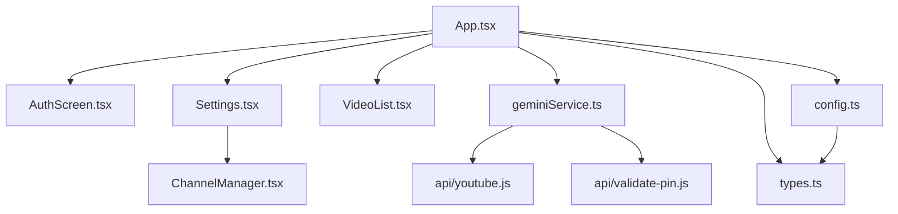

# AGENTS.md - TubeTracker AI

## PROJECT OVERVIEW

**Name:** TubeTracker AI  
**Type:** Privacy-focused YouTube video tracker  
**Purpose:** Algorithm-free chronological video feeds from user-specified channels  
**Data Storage:** Browser localStorage only (no backend database)  
**Authentication:** PIN-based access control  

## TECH STACK

| Layer | Technology | Version | Notes |
|-------|-----------|---------|-------|
| Frontend Framework | React | 19.2.0 | Functional components with hooks |
| Language | TypeScript | ~5.8.2 | Full type safety |
| Build Tool | Vite | ^6.2.0 | HMR, ES modules |
| Styling | Tailwind CSS | CDN | Dark mode via `class` strategy |
| Icons | Lucide React | ^0.554.0 | Consistent icon system |
| Backend | Vercel Serverless Functions | - | API proxy endpoints |
| External API | YouTube Data API v3 | - | Video/channel data only |

## PROJECT STRUCTURE

```
tubetracker-ai/
├── api/
│   ├── youtube.js              # Serverless API proxy (PIN validation, API key injection, endpoint whitelist)
│   └── validate-pin.js         # Lightweight PIN validation endpoint
├── components/
│   ├── AuthScreen.tsx          # PIN entry screen with validation
│   ├── ChannelManager.tsx      # Channel add/remove with handle validation
│   ├── Settings.tsx            # Settings + Profile Management UI
│   └── VideoList.tsx           # Video grid with search/filter/duration display
├── services/
│   └── geminiService.ts        # API communication layer (misnamed - no Gemini API)
├── types.ts                    # TypeScript interfaces
├── config.ts                   # Default configuration
├── App.tsx                     # Main component (state, persistence, auto-refresh, profile management)
├── index.tsx                   # React entry point
├── index.html                  # HTML shell with Tailwind config
├── vite.config.ts              # Vite configuration
├── vercel.json                 # Vercel deployment config
└── package.json                # Dependencies and scripts
```

## TYPE DEFINITIONS

```typescript
// types.ts - Core interfaces

interface Channel {
  id: string;                  // YouTube Channel ID (UC...)
  name: string;                // Channel display name
  handle?: string;             // @handle format
  thumbnail?: string;          // Avatar URL
  uploadsPlaylistId: string;   // Uploads playlist ID (UU...)
}

interface VideoResult {
  id: string;
  title: string;
  channelName: string;
  channelId: string;
  url: string;                 // https://www.youtube.com/watch?v=...
  publishedAt: string;         // ISO 8601
  thumbnail: string;
  description: string;
  duration?: string;           // ISO 8601 duration (PT15M33S)
  viewCount?: string;
}

interface SearchState {
  isLoading: boolean;
  error: string | null;
  lastUpdated: number | null;  // Unix timestamp
  videos: VideoResult[];
}

interface Profile {
  id: string;                  // UUID or 'default'
  name: string;
  channels: Channel[];
  searchState: SearchState;
}

interface AppConfig {
  daysBack: number;            // 1-60 days
  autoRefreshHours: number;    // 1-48 hours
  theme: 'dark' | 'light';
  debugLogging?: boolean;
  maxResults?: number;         // 5-50 per channel
  minDuration?: number;        // Seconds (0 to disable)
}

interface ProfileConfig {
  name: string;
  channels: string[];          // Handles like @channelname
}

interface ConfigFile {
  defaultChannels: string[];   // Legacy - loads into "Default" profile
  defaultProfiles?: ProfileConfig[];
  defaultLookbackDays: number;
  defaultAutoRefreshHours: number;
  defaultTheme: 'dark' | 'light';
  defaultDebugLogging?: boolean;
  defaultMaxResults?: number;
  defaultMinDuration?: number;
}
```

## ENVIRONMENT VARIABLES

| Variable | Scope | Purpose | Required |
|----------|-------|---------|----------|
| `API_KEY` | Server-side | YouTube Data API v3 key | Yes |
| `AUTH_PIN` | Server-side | Access PIN for authentication | Yes |

**Security Rule:** API key and PIN are NEVER exposed to the client. All API calls go through `/api/youtube.js` proxy.

## DEFAULT CONFIGURATION

```typescript
// config.ts defaults
{
  defaultChannels: ["@AICodeKing", "@mreflow"],  // Legacy fallback
  defaultProfiles: [
    { name: "AI & Coding", channels: ["@AICodeKing", "@mreflow", "@matthew_berman"] },
    { name: "Finance", channels: ["@JosephCarlsonShow", "@EverythingMoney"] }
  ],
  defaultLookbackDays: 5,
  defaultAutoRefreshHours: 1,
  defaultTheme: 'dark',
  defaultDebugLogging: true,
  defaultMaxResults: 20,
  defaultMinDuration: 90
}
```

## DATA FLOW

```
User Input (AuthScreen)
    │
    ▼
PIN Validation ──────────────────────────────────────────┐
    │                                                    │
    ▼                                                    ▼
App.tsx (State Management)                      api/validate-pin.js
    │                                                    │
    ├── Profiles State (localStorage)                    │
    ├── Config State (localStorage)                      │
    ├── Auth State (localStorage) ◄──────────────────────┘
    │
    ├── Profile Management (CRUD in App.tsx)
    │
    ├── Channel Actions ──────────────────────┐
    │       │                                  │
    │       ▼                                  │
    │   searchChannel()                        │
    │       │                                  │
    │       ▼                                  │
    │   api/youtube.js?endpoint=channels       │
    │       │                                  │
    │       ◄──────────────────────────────────┘
    │
    ├── Video Scan ───────────────────────────┐
    │       │                                  │
    │       ▼                                  │
    │   fetchRecentVideos()                    │
    │       │                                  │
    │       ├──► api/youtube.js?endpoint=playlistItems (per channel)
    │       │                                  │
    │       ├──► api/youtube.js?endpoint=videos (batch 50)
    │       │                                  │
    │       ◄──────────────────────────────────┘
    │
    ▼
UI Render (VideoList / Settings)
```

## SECURITY MODEL

1. **API Key Protection**: Stored in Vercel Environment Variables (`API_KEY`), injected server-side only
2. **PIN Authentication**: 
   - Frontend stores PIN in localStorage (`tubetracker_auth_pin`)
   - Every API request includes `x-auth-pin` header
   - Server validates against `AUTH_PIN` env var
   - Dedicated `/api/validate-pin.js` for lightweight validation
3. **Endpoint Whitelisting**: Only `search`, `channels`, `playlistItems`, `videos` allowed
4. **No Client Secrets**: API key never reaches browser

## LOCAL STORAGE SCHEMA

| Key | Purpose | Format |
|-----|---------|--------|
| `tubetracker_profiles_v1` | All profiles with channels and search state | JSON array of Profile |
| `tubetracker_active_profile_v1` | Currently active profile ID | String |
| `tubetracker_config_v2` | User preferences | JSON AppConfig |
| `tubetracker_auth_pin` | Stored PIN for API headers | String |
| `tubetracker_data_version` | Data structure version | String ("4") |
| `tubetracker_config_loaded_v3` | Config initialization flag | String ("true") |
| `tubetracker_channels_v3` | Legacy channels (migration source) | JSON array |
| `tubetracker_search_state_v1` | Legacy search state (migration source) | JSON SearchState |

## DEVELOPMENT COMMANDS

```bash
# Install dependencies
npm install

# Development with API proxy (recommended)
vercel dev

# Frontend only (API calls will fail)
npm run dev

# Production build
npm run build

# Preview production build
npm run preview

# Deploy to production
vercel --prod
```

## KEY COMPONENTS

### App.tsx
- **State:** `profiles[]`, `activeProfileId`, `config`, `isAuthenticated`, `isScanning`
- **Effects:** Data migration, config sync, auto-refresh timer, theme application
- **Actions:** `handleScan()`, `handleAddChannel()`, `handleRemoveChannel()`, `handleCreateProfile()`, `handleDeleteProfile()`
- **Notes:** Profile selector is inline (no separate component). Profile CRUD happens here.

### AuthScreen.tsx
- **Props:** `onAuthenticated: () => void`
- **Behavior:** Validates PIN via `validatePin()`, stores in localStorage, calls callback

### Settings.tsx
- **Props:** config, profiles, activeProfileId, channel callbacks, isLoading
- **Sections:** Profile Management, Lookback, Max Results, Min Duration, Auto Refresh, Appearance, Debug Logging, Channel Manager
- **Notes:** Contains both settings UI and profile management UI (no separate ProfileManager component)

### ChannelManager.tsx
- **Props:** `channels[]`, `onAdd(name)`, `onRemove(id)`, `disabled`
- **Features:** Comma-separated batch input, handle validation, duplicate detection, thumbnail display

### VideoList.tsx
- **Props:** `videos[]`, `isLoading`, `hasSearched`
- **Features:** Responsive grid, duration parsing, view count formatting, time-ago display

## API ENDPOINTS

### `/api/youtube.js`
- **Method:** GET
- **Headers:** `x-auth-pin`, `x-debug-logging` (optional)
- **Query Params:** `endpoint`, `part`, `key=API_KEY` (injected)
- **Allowed Endpoints:** `search`, `channels`, `playlistItems`, `videos`
- **Response:** Proxied YouTube API JSON response

### `/api/validate-pin.js`
- **Method:** GET
- **Headers:** `x-auth-pin`
- **Response:** `{ success: true }` or 401 error

## YOUTUBE API USAGE

| Operation | Endpoint | Cost |
|-----------|----------|------|
| Channel resolution | `channels.list` | 1 unit |
| Fetch uploads | `playlistItems.list` | 1 unit per channel |
| Video details | `videos.list` | 1 unit per 50 videos |

**Quota:** 10,000 units/day (default GCP project)

## KNOWN CONSTRAINTS

1. **API Key Security**: Never commit API key - always use Vercel Environment Variables
2. **Channel Handles**: Must use `@handle` format, not channel IDs
3. **localStorage Limits**: ~5-10MB storage cap
4. **Serverless Timeouts**: API calls must complete within Vercel's function timeout (10s default, 60s max)
5. **React 19**: Using latest React - some patterns may differ from React 18
6. **Gemini SDK Unused**: `@google/genai` is installed but not used in the application

## FILE DEPENDENCIES


```mermaid
graph TD
    App.tsx --> AuthScreen.tsx
    App.tsx --> Settings.tsx
    App.tsx --> VideoList.tsx
    Settings.tsx --> ChannelManager.tsx
    App.tsx --> geminiService.ts
    geminiService.ts --> api/youtube.js
    geminiService.ts --> api/validate-pin.js
    App.tsx --> config.ts
    App.tsx --> types.ts
    config.ts --> types.ts
```

## TESTING CHECKLIST

- [ ] PIN authentication works (valid/invalid PIN handling)
- [ ] New channels add correctly with `@handle` format
- [ ] Video feed updates after scan
- [ ] Settings persist across reloads
- [ ] Profile switching preserves channel data
- [ ] Theme toggle works (dark/light)
- [ ] API errors show user-friendly messages
- [ ] Duplicate channel detection works
- [ ] Min duration filter excludes Shorts correctly
- [ ] Auto-refresh triggers correctly after interval

## CODE STYLE GUIDELINES

- Functional React components with hooks
- TypeScript interfaces for all data structures
- Tailwind CSS for styling (dark mode first, `dark:` prefixes)
- localStorage for persistence with versioned keys
- Server-side API proxy for security (never call YouTube API directly from client)
- Explicit error handling with user-friendly messages
- Batch operations for API efficiency (50 videos per `videos.list` call)

## COMMON TASKS

### Adding a New Setting
1. Add to `AppConfig` interface in `types.ts`
2. Add to `ConfigFile` interface if also needed in `config.ts`
3. Add to `Settings.tsx` UI (follow existing toggle/input patterns)
4. Add to localStorage persistence in `App.tsx`

### Adding a New Component
1. Create in `components/` folder
2. Export from component file
3. Use existing TypeScript interfaces for props
4. Follow Tailwind CSS styling patterns
5. Handle loading/error states like existing components

### Modifying API Behavior
- Edit `api/youtube.js` for YouTube API calls
- PIN validation happens server-side in both endpoints
- All responses are returned to `geminiService.ts`

### Managing Profiles
- Profiles are stored in localStorage under `tubetracker_profiles_v1`
- Each profile has unique ID (timestamp or UUID), name, and channel array
- Active profile ID stored in `tubetracker_active_profile_v1`
- Profile CRUD operations are in `App.tsx`
- Settings UI for profiles is in `Settings.tsx`

## MIGRATION NOTES

- **v3 → v4**: Old single-profile data (`tubetracker_channels_v3`, `tubetracker_search_state_v1`) is automatically migrated to a "Default" profile
- **Config Sync**: Default profiles from `config.ts` are resolved on first auth if no profiles exist with channels
